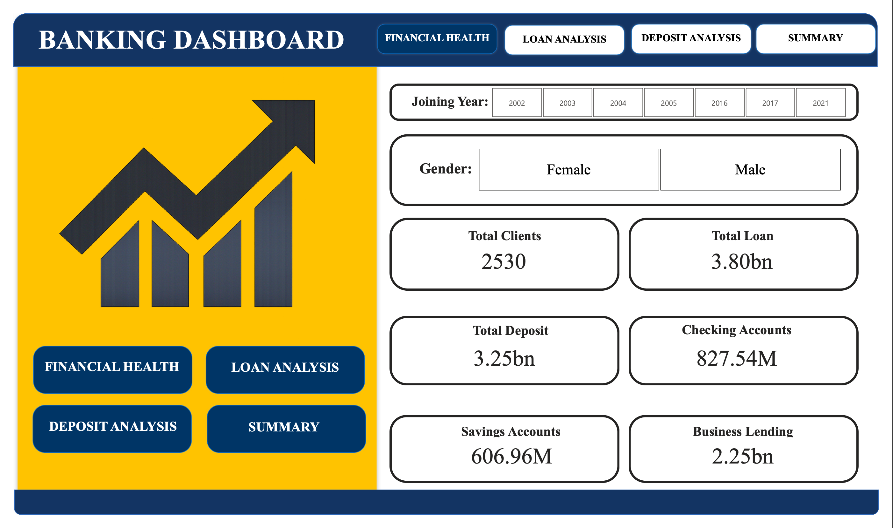
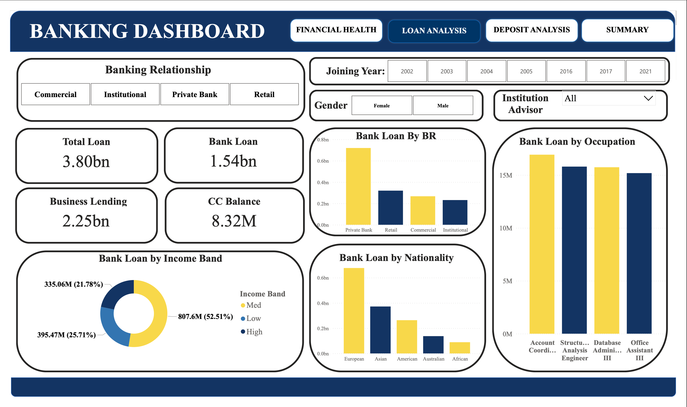
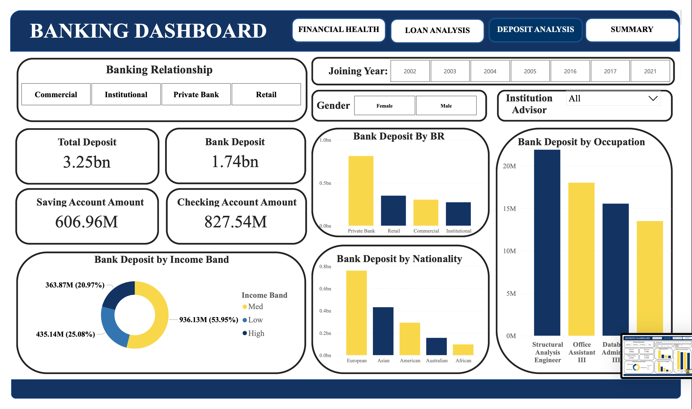
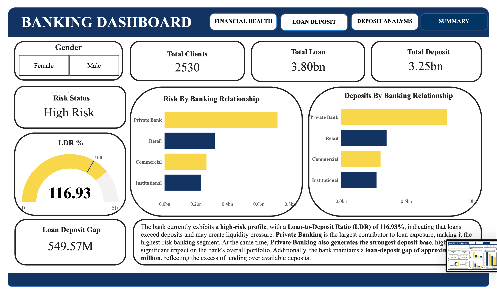

<div align="center">

# 🏦 Banking Risk & Portfolio Analysis

### Python Exploratory Data Analysis • Power BI • Financial Analytics

An end-to-end banking analytics project exploring **2,530 clients**,  
**3.80B in loans**, and **3.25B in deposits** to identify portfolio trends,  
financial exposure, customer segments, and risk indicators.

<br>


</div>

---

## 📌 Project Overview

This project presents an end-to-end analysis of a banking portfolio using
**Python for Exploratory Data Analysis (EDA)** and **Power BI for business
intelligence and interactive visualization**.

The analysis focuses on understanding:

✔ Loan and deposit distribution  
✔ Customer and income segmentation  
✔ Banking relationship performance  
✔ Portfolio concentration  
✔ Loan-to-Deposit Ratio (LDR)  
✔ Loan-deposit funding gap  
✔ Financial and portfolio risk indicators  

---

## 📊 Portfolio at a Glance

| 👥 Clients | 💳 Total Loans | 💰 Total Deposits | 📈 LDR | ⚠️ Loan-Deposit Gap |
|:---:|:---:|:---:|:---:|:---:|
| **2,530** | **3.80B** | **3.25B** | **116.93%** | **549.57M** |

---

## 🔄 Analytics Workflow

| Stage | Process | Description |
|:---:|---|---|
| **01** | 📂 **Data Collection** | Banking customer and financial portfolio dataset |
| ↓ | | |
| **02** | 🐍 **Python EDA** | Data exploration, validation, distributions and pattern identification |
| ↓ | | |
| **03** | 🧹 **Data Preparation** | Data quality checks, feature exploration and customer segmentation |
| ↓ | | |
| **04** | 📊 **Statistical Analysis** | Descriptive statistics, financial-variable analysis and correlation analysis |
| ↓ | | |
| **05** | ⚡ **Power BI & DAX** | Data modeling, calculated measures, KPIs and interactive visualizations |
| ↓ | | |
| **06** | 📈 **Dashboard Development** | Financial Health, Loan, Deposit and Risk Summary dashboards |
| ↓ | | |
| **07** | 💡 **Business Insights** | Portfolio trends, financial exposure and risk indicators translated into actionable insights |

---
## 🎯 Business Problem & Objectives

Banks manage large portfolios of customer deposits, loans, and other financial products. Effective portfolio monitoring requires understanding how lending and deposits are distributed across customer segments and identifying areas where financial exposure may be concentrated.

This project aims to transform banking data into actionable insights by answering the following questions:

- How large are the bank's overall loan and deposit portfolios?
- How are loans and deposits distributed across different banking relationships?
- Which customer segments contribute the most to lending and deposits?
- How do income bands, occupations, and nationalities influence portfolio distribution?
- Does the bank maintain an appropriate balance between loans and deposits?
- Which segments represent the highest portfolio exposure?
- What financial indicators should management monitor for potential liquidity or concentration risk?

---

## 📂 Dataset Overview

The dataset contains customer-level banking and financial information used to analyze portfolio composition and customer behavior.

### Key analytical dimensions include:

| Category | Examples |
|---|---|
| 👤 **Customer Profile** | Gender, Nationality, Occupation |
| 🏦 **Banking Relationship** | Private Bank, Retail, Commercial, Institutional |
| 💰 **Financial Position** | Deposits, Loans, Savings and Checking Accounts |
| 📊 **Customer Segmentation** | Income Bands and Banking Relationships |
| 📅 **Relationship Information** | Joining Year and Institutional Advisor |

The dataset was explored using **Python** before being modeled and visualized in **Power BI**.

---

## 🐍 Python Exploratory Data Analysis

Before dashboard development, Exploratory Data Analysis was performed in **Google Colab using Python** to understand the structure, quality, distributions, and relationships within the banking data.

### EDA Process

- Inspected dataset dimensions, columns and data types
- Reviewed descriptive statistics for numerical variables
- Examined categorical variables and customer distributions
- Analyzed financial variables such as loans and deposits
- Investigated customer segmentation across different attributes
- Created income-band segmentation for comparative analysis
- Visualized numerical and categorical distributions
- Performed correlation analysis across financial variables
- Identified patterns that guided the Power BI dashboard design

### Python Libraries

`Pandas` • `NumPy` • `Matplotlib` • `Seaborn`

> 📓 The complete analysis is available in the **`notebooks/Banking_Risk_EDA.ipynb`** notebook.

---

## 🧹 Data Preparation & Analytical Features

The dataset was prepared for analysis before dashboard development.

Key preparation steps included:

- Reviewing missing and inconsistent values
- Validating numerical and categorical fields
- Examining data distributions and potential anomalies
- Creating **Income Band** categories for customer segmentation
- Preparing financial variables for portfolio-level aggregation
- Structuring analytical dimensions for Power BI filtering and visualization

This preparation enabled consistent analysis across customer demographics, banking relationships, loans, deposits, and portfolio-level KPIs.

---

## ⚡ Power BI & DAX Analysis

Power BI was used to transform the prepared banking data into an interactive business intelligence solution.

### Dashboard capabilities include:

- Executive-level KPI monitoring
- Loan portfolio analysis
- Deposit portfolio analysis
- Customer segmentation
- Banking relationship comparison
- Income-band analysis
- Nationality and occupation analysis
- Interactive filtering using slicers
- Portfolio risk and financial-health indicators

### Key Measures / KPIs

| Measure | Purpose |
|---|---|
| **Total Clients** | Measures overall customer portfolio size |
| **Total Loans** | Tracks total lending exposure |
| **Total Deposits** | Measures total deposit base |
| **Loan-to-Deposit Ratio (LDR)** | Compares lending with available deposits |
| **Loan-Deposit Gap** | Measures the difference between loans and deposits |
| **Bank Loans / Deposits** | Evaluates core banking portfolio values |
| **Savings / Checking Accounts** | Analyzes deposit-account composition |

---
## 🖥️ Dashboard Preview

### Financial Health Overview

<p align="center">
  
</p>

### Loan Portfolio Analysis

<p align="center">
  
</p>

### Deposit Portfolio Analysis

<p align="center">
  
</p>

### Risk & Portfolio Summary

<p align="center">
  
</p>

## 🔍 Key Business Questions Answered

### 1. What is the overall size of the banking portfolio?
The analyzed portfolio contains **2,530 clients**, approximately **3.80B in total loans**, and **3.25B in total deposits**.

### 2. Which banking relationship has the greatest portfolio exposure?
**Private Banking** represents the largest share of loan exposure among the analyzed banking relationships.

### 3. Which segment contributes the strongest deposit base?
**Private Banking** also contributes the largest deposit volume, making it a strategically important segment on both sides of the portfolio.

### 4. Are loans adequately supported by deposits?
The portfolio has an **LDR of 116.93%**, meaning total lending exceeds the deposit base represented in the dataset.

### 5. What is the gap between loans and deposits?
Loans exceed deposits by approximately **549.57M**, highlighting a funding imbalance that warrants monitoring.

### 6. How is portfolio exposure distributed?
The dashboard enables comparison across **banking relationship, income band, nationality, occupation, gender, and joining year**, helping identify concentrations within different customer segments.

---

## 💡 Key Insights

> **01 — Lending exceeds deposits**  
> Total loans of **3.80B** exceed deposits of **3.25B**, resulting in a **549.57M loan-deposit gap**.

> **02 — Elevated Loan-to-Deposit Ratio**  
> The calculated **116.93% LDR** indicates that lending exceeds the deposit base represented in the portfolio.

> **03 — Private Banking is a key portfolio segment**  
> Private Banking contributes the highest loan exposure while also maintaining the strongest deposit contribution.

> **04 — Medium-income customers represent a major portfolio share**  
> Income-band analysis shows that the medium-income segment contributes a substantial proportion of both loans and deposits.

> **05 — Portfolio concentration can be analyzed across multiple dimensions**  
> Nationality, occupation, banking relationship and income segmentation reveal where financial activity is concentrated.

---

## 🎯 Business Impact & Recommendations

The analysis demonstrates how banking data can support management and risk-monitoring decisions.

- **Monitor the LDR regularly** to identify changes in the relationship between lending and deposit funding.
- **Track the loan-deposit gap** as an indicator of potential funding pressure.
- **Monitor Private Banking exposure** because of its significant contribution to both lending and deposits.
- **Use customer segmentation** to understand concentration across income, occupation and nationality groups.
- **Apply interactive dashboards** to reduce manual reporting effort and enable faster management-level analysis.
- **Investigate high-exposure segments further** using additional credit-quality measures where available.

> **Analytical Scope:** This project evaluates portfolio-level financial exposure using the available banking dataset. It does not represent a regulatory credit-risk model, fraud-detection model, or probability-of-default assessment.

---

## 📁 Repository Structure

```text
Banking-Risk-Portfolio-Analysis/
│
├── 📄 README.md
├── 📄 LICENSE
│
├── 📂 data/
│   └── banking_data.csv
│
├── 📂 notebooks/
│   └── Banking_Risk_EDA.ipynb
│
├── 📂 powerbi/
│   └── Banking_Risk_Dashboard.pbix
│
├── 📂 images/
│   ├── financial_health_dashboard.png
│   ├── loan_analysis_dashboard.png
│   ├── deposit_analysis_dashboard.png
│   └──risk_summary_dashboard.png
│ 
└── 📂 documentation/
    ├──Project_report.pdf
    └──Banking-Risk-and-Portfolio-Analysis.pptx
    
